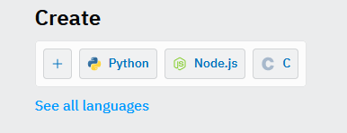
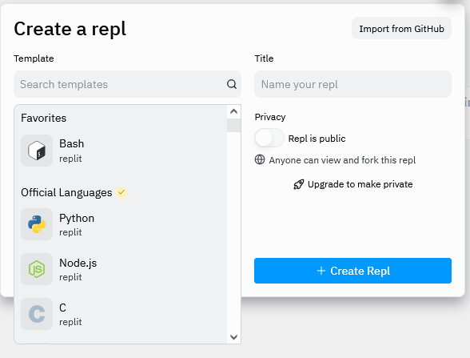
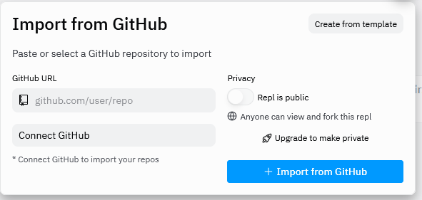
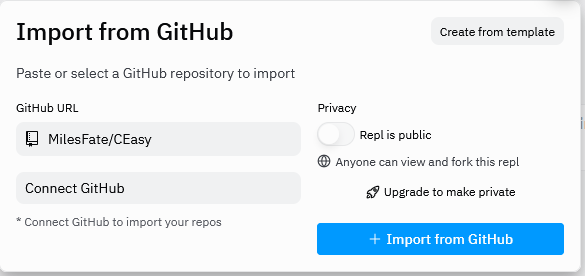
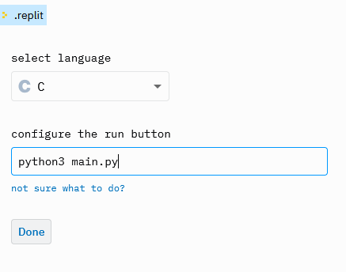

This Repo Is to Make Testing C Code easy
-
  This repo's main goal is to allow one to focus on working with C files and not having to worry about how to compile them. By running the script and entetring the name of your C file you will be able to, Compile the code, make an Executable, run the Executable, and move that Executable to the folder exe. All without having to type a single linux command!

  ***Put your Code in the `fdlr` folder or the python script wont work!!!!***

This Repo Can
-
  >[x] Compiles C files

  >[x] Runs the Executable

  >[x] Keep Directory Clean

  >[x] Help with C syntax

Setting up This Repo
-
  To start you will want to make a new repl. https://replit.com/~
  
  

  Select `Import from GitHub. `

  

  Paste this https://github.com/MilesFate/CEasy.git and select `Import`.

  

  

  After pulling from GitHub you will need to set this repo up.

  It will prompt you to select a language and a command.

  

  >language will be  `C`

  >command will be `python3 main.py`

  After this is entered just click done and use this how every you want ^_^ !

Useful C Notes/Documentation
-
  https://www.programiz.com/c-programming

  https://devdocs.io/c/

  https://docs.microsoft.com/en-us/cpp/c-language/?view=msvc-160